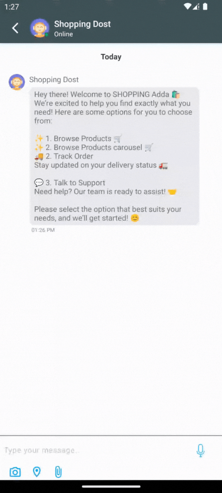
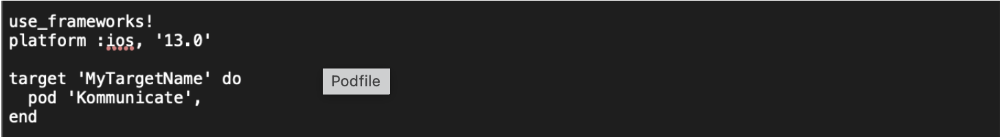
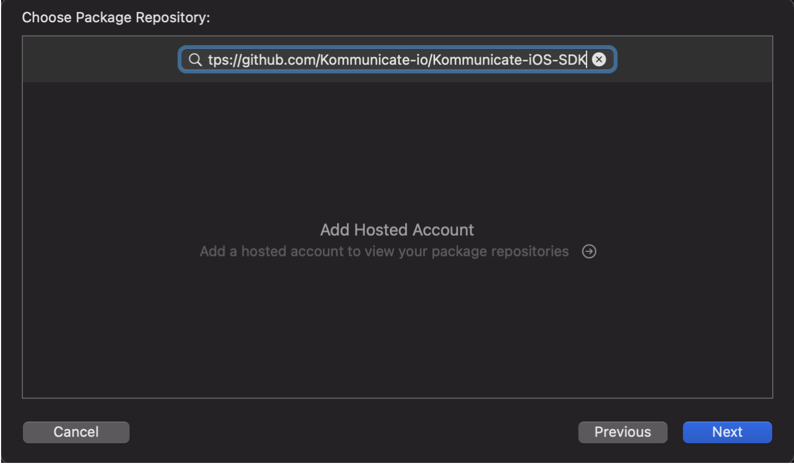
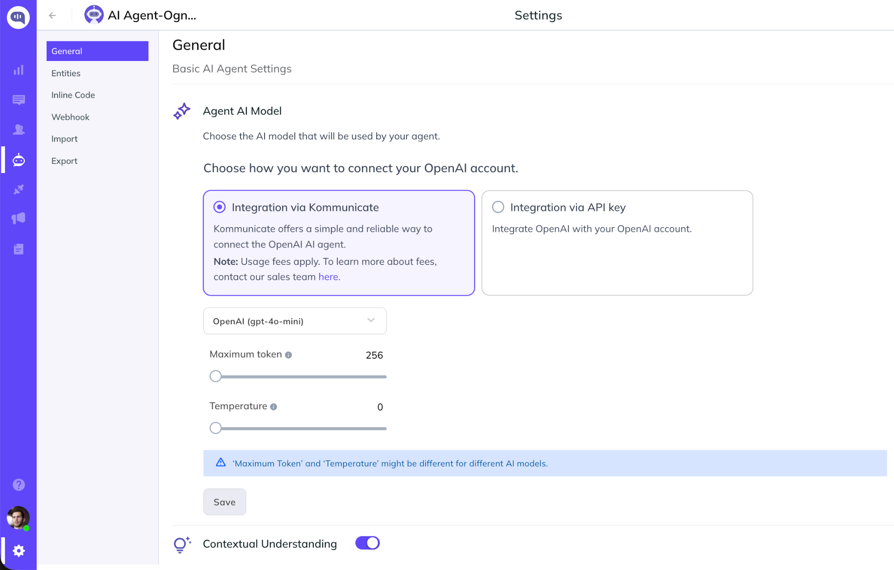
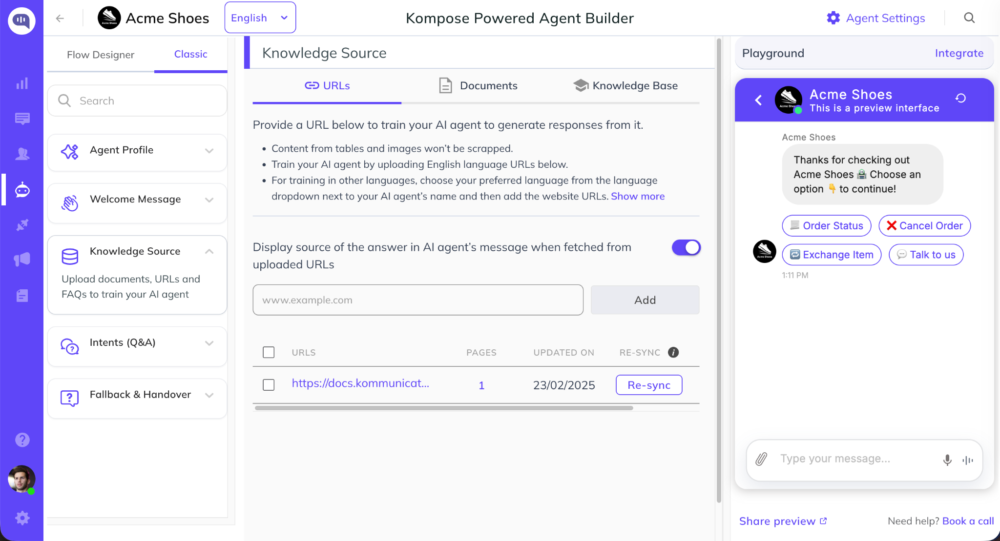
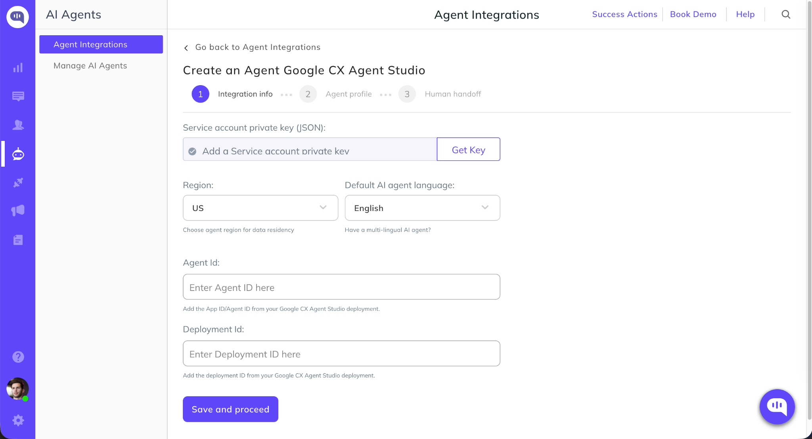
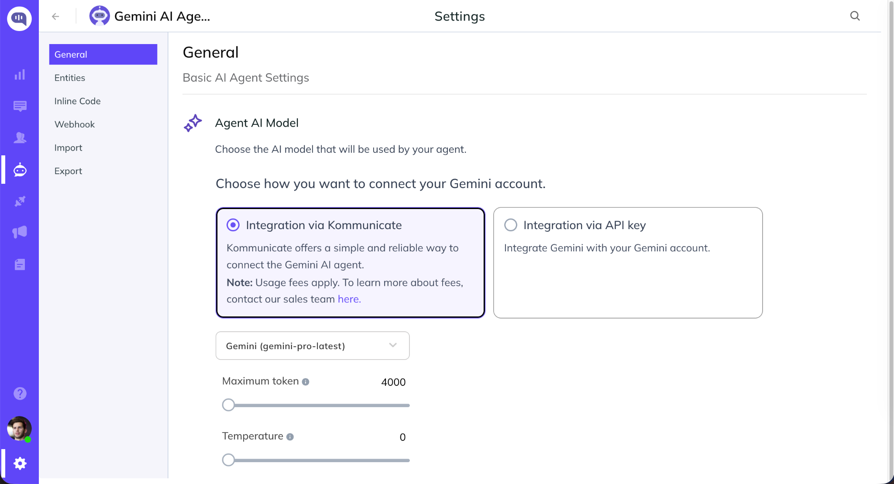
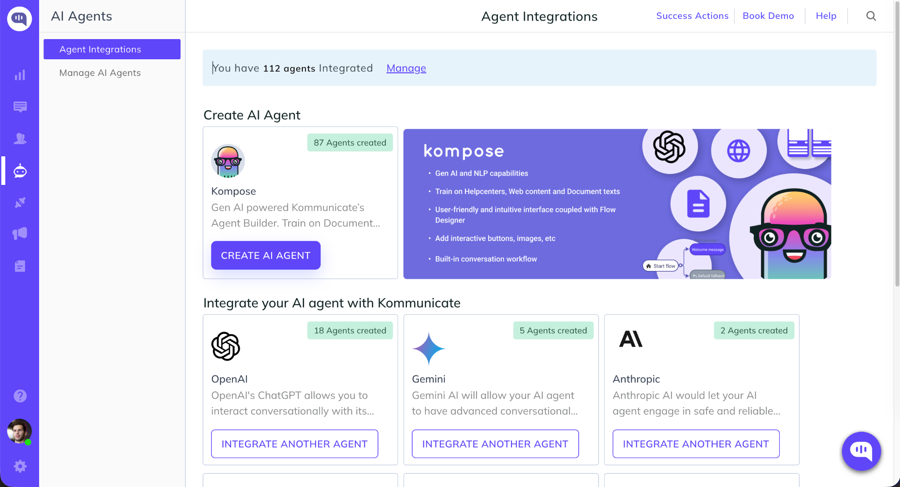

# Kommunicate iOS SDK for Chat

An Open Source iOS SDK for enabling AI Agent, AI chatbot, and Live Chat into your iOS App

## Overview

Kommunicate's iOS SDK helps developers add conversational support experiences to iPhone and iPad applications. With a simple integration process and native iOS compatibility, teams can quickly launch AI-powered customer support, live chat, and in-app messaging without building messaging infrastructure from scratch.

The SDK supports a wide range of communication features, including multimedia attachments, rich interactive messages, location sharing, push notifications, and real-time conversations. These capabilities enable businesses to provide seamless support directly within their iOS applications.

Developers can also connect AI agents to automate customer interactions, handle frequently asked questions, and provide instant assistance around the clock. The SDK works with the latest AI models from OpenAI, Anthropic, Google Gemini, and Google CX Agent Studio, making it easy to deploy intelligent customer support experiences.

For cases that require human intervention, Kommunicate offers built-in agent handoff functionality. Conversations can be automatically escalated from AI agents to support representatives, ensuring customers receive personalized assistance whenever needed. Support teams can manage and respond to chats through the Kommunicate dashboard while maintaining complete conversation history.

Beyond mobile applications, Kommunicate serves as a unified customer communication platform by bringing together conversations from websites, email, voice, WhatsApp, Telegram, Instagram, Viber, LINE, and other channels. This centralized approach helps support teams improve productivity, reduce response times, and deliver consistent customer experiences across every touchpoint.



## Build an AI Agent with Kommunicate and Integrate It into Your iOS App

### Kompose AI Agent Builder

Kompose is Kommunicate's no-code AI agent builder that enables businesses to create and deploy customer support AI agents across chat, email, and voice channels. You can build an AI agent without writing code by simply uploading your knowledge sources, such as documents, help center articles, and website content, and providing instructions for how the agent should respond.

**Key Features**

- No-code AI agent builder
- Support for OpenAI, Anthropic, Google Gemini, and Google CX Agent Studio
- Knowledge base training using websites, PDFs, and help center content
- Voice AI capabilities
- Lead capture forms
- Rich messaging and media sharing
- Human agent handoff
- Analytics and AI performance monitoring

Kommunicate also includes a built-in human-in-the-loop support system. When an AI agent cannot resolve a customer query, conversations can be automatically escalated to a live support representative. All interactions are managed from a centralized dashboard, allowing teams to monitor conversations, review AI performance, and improve customer support workflows.

Requirements

- iApps using Kommunicate can target iOS 13 or later
- Xcode 12 or later required

## Installation

Option 1: CocoaPods

Kommunicate is available through [CocoaPods](https://guides.cocoapods.org/using/using-cocoapods.html). To install it, add the following line to your Podfile:

```ruby
pod 'Kommunicate' , '~> 7.3.4' // Latest Version
```

This is how the podfile will look:



Then run the following command:

```bash
pod install
```

In any file you'd like to use Kommunicate in, don't forget to import the framework as shown below:

```swift
import Kommunicate
```

Note: You can test Kommunicate using CocoaPods by referring to the Kommunicate Sample App repository. During testing, you can use both the local repository and the CocoaPods repository by removing the local path of Kommunicate from the Podfile.

Note: If you are using Kommunicate in an Objective-C app, then check this sample app in Objective-C. Create a wrapper file in Swift and call the functions in the wrapper from Objective-C files in your Project.

Option 2: Swift Package Manager (SPM)

Follow these steps to add Kommunicate package:

- In your project, go to File > Swift Packages > Add Package Dependency
- Enter the Kommunicate iOS SDK repo in the URL field.
- Click on Next and wait till the package is added to your project.



For more details, please refer to this [doc link](https://developer.apple.com/documentation/swift_packages/adding_package_dependencies_to_your_app).

Note: To test Kommunicate with Swift Package Manager (SPM), please check this Kommunicate SPM Sample App repository.

## Permissions

Add permissions for Camera, Photo Library, Microphone and Location usage.

Note: We won't be asking the users for these permissions unless they use the respective feature. Due to Apple's requirement, we have to add these permissions if we are using any of their APIs related to Camera, Microphone etc.

In your app's Info.plist file as `Source code` and paste these permissions anywhere inside the `<dict>` tag.

```xml
<key>NSCameraUsageDescription</key>
<string>Allow Camera</string>
<key>NSLocationWhenInUseUsageDescription</key>
<string>Allow location sharing!!</string>
<key>NSMicrophoneUsageDescription</key>
<string>Allow MicroPhone</string>
<key>NSPhotoLibraryUsageDescription</key>
<string>Allow Photos</string>
<key>NSPhotoLibraryAddUsageDescription</key>
<string>Allow write access</string>
```

For more information on authentication, push notification, customization, etc, check out our official documentation [here](https://docs.kommunicate.io/docs/ios-installation).

## AI Integration Availability

Kommunicate provides integration with the latest AI models from OpenAI, Anthropic, and Google Gemini.

## OpenAI-powered AI Agent Integration for iOS App

Kommunicate's OpenAI integration enables businesses to deploy AI-powered customer support agents using OpenAI's latest models. These agents can answer customer queries, automate repetitive support tasks, and seamlessly transfer conversations to human agents when required.

### Integrations Options

You can connect OpenAI to Kommunicate in two ways:

Managed Integration via Kommunicate

- No OpenAI account setup required
- Select an OpenAI model directly within Kommunicate
- Simplified billing and configuration

Bring Your Own OpenAI API Key

- Connect your existing OpenAI account
- Full control over model selection and API usage
- Use your own OpenAI billing account

**Deployment Steps**

**Step 1: Create an AI Agent**

Navigate to Agent Integrations and create a new AI agent using Kompose AI Agent Builder.


**Step 2: Configure OpenAI**

Choose either:

- Integration via Kommunicate and select an OpenAI model, or
- Integration via API Key and enter your OpenAI API credentials.

Configure model settings such as response length and creativity, then save your configuration.



**Step 3: Train Your AI Agent**

Upload documents, connect your help center, or add website URLs to build your AI agent's knowledge base.



## Google CX Agent Studio Integration for iOS App

Kommunicate integrates with Google CX Agent Studio, allowing organizations to deploy Dialogflow and CX Agent Studio agents through Kommunicate's omnichannel support platform.

**Why Use This Integration?**

- Leverage existing Google CX Agent Studio agents
- Add live chat and human handoff capabilities
- Access centralized conversation management
- Deploy across web and mobile channels

### Steps to Deploy Google CX Agent Studio AI Agent with Kommunicate

Step 1: Connect Google CX Agent Studio



**Step 2: Add Google Credentials**

Enter the required Google Cloud and CX Agent Studio credentials, including project details and authentication information.

Once validated, Kommunicate will establish the connection with your Google agent.

## Google Gemini-powered AI Agent Integration for iOS App

Kommunicate's Google Gemini integration enables businesses and developers to build, deploy, and manage AI-powered customer support agents across websites and digital channels. Use the latest AI models from Google Gemini.

### Ways to Connect Google Gemini with Kommunicate

You can create an Google Gemini-powered AI agent in Kommunicate using either of the following methods:

Integration via Kommunicate

Use Kommunicate's managed Google Gemini integration and select your preferred Gemini model directly from the platform.

Integration via Google Gemini API Key

Connect your own Google Gemini account by providing a Gemini API key and configuring the AI agent within Kommunicate.

**Setup Instructions**

Step 1: Create an AI Agent: After signing up for Kommunicate, navigate to Agent Integrations and create a new AI agent using Kompose AI Agent Builder or select Gemini integration.


Step 2: Choose Your Google Gemini Integration Method

Select how you would like to connect Google Gemini to your AI agent:

- Integration via Kommunicate - Choose a Google Gemini model directly from Kommunicate and start building your AI agent.
- Integration via API Key - Connect your Google Gemini account by entering your OpenAI API key and configuring the agent with your preferred model and settings.

Once configured, save the settings and begin training your AI agent with your website content, documents, or help center articles.



## Anthropic-powered AI Agent Integration for iOS App

Kommunicate's Anthropic integration enables businesses and developers to build, deploy, and manage AI-powered customer support agents across websites and digital channels. Use the latest AI models from Anthropic and resolve customer support queries accurately and instantly.

### Ways to Connect Anthropic with Kommunicate

You can create an Anthropic-powered AI agent in Kommunicate using either of the following methods:

Integration via Kommunicate

Use Kommunicate's managed Anthropic integration and select your preferred Anthropic model directly from the platform.

Integration via Google Gemini API Key

Connect your own Anthropic account by providing an Anthropic API key and configuring the AI agent within Kommunicate.

**Setup Instructions**

Step 1: Create an AI Agent: After signing up for Kommunicate, navigate to Agent Integrations and create a new AI agent using Kompose AI Agent Builder or select Anthropic integration.



Step 2: Choose Your Anthropic Integration Method

Select how you would like to connect Anthropic to your AI agent:

- Integration via Kommunicate - Choose an Anthropic model directly from Kommunicate and start building your AI agent.
- Integration via API Key - Connect your Antropic account by entering your OpenAI API key and configuring the agent with your preferred model and settings.

Once configured, save the settings and begin training your AI agent with your website content, documents, or help center articles.


